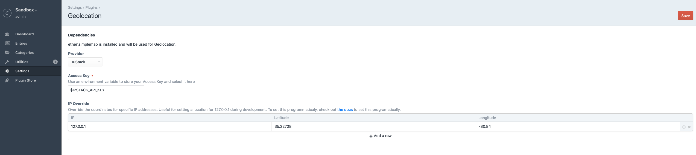
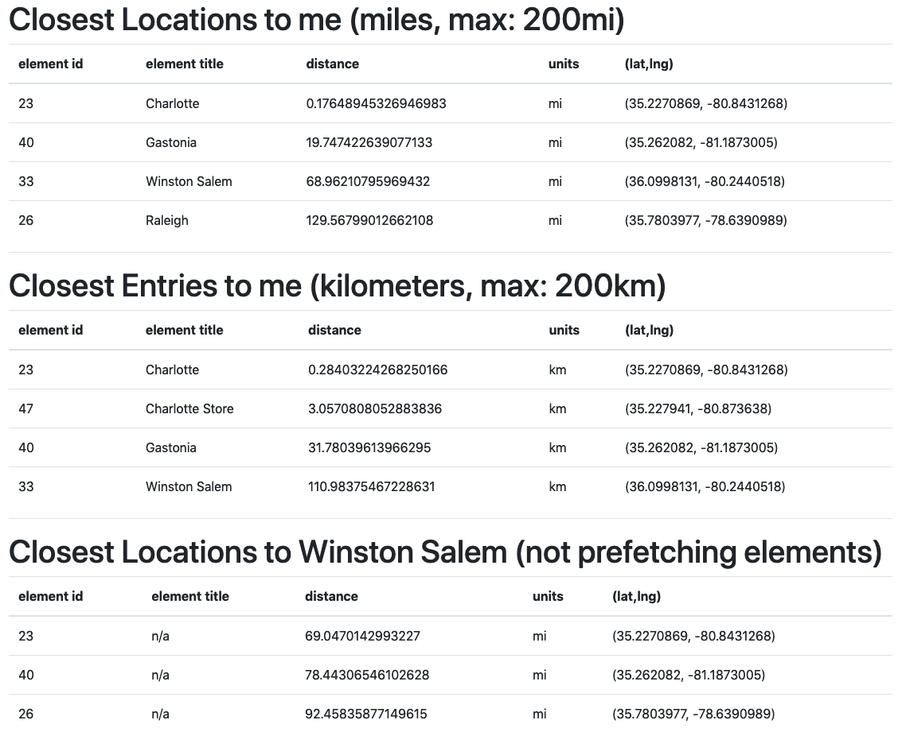

# Geolocation

## Overview

Craft 3 plugin to integrate geolocation and distance calculation helpers.

This plugin comes with two pre-configured geolocation providers: [IPStack](https://ipstack.com) and [Google Maps](https://developers.google.com/maps/documentation/geocoding/intro). Additionally, it provides an interface and various events to allow you to use any geolocation provider you desire. See the Extending Geolocation Providers section, below.

For calculating distance between elements, requires the `Map` field provided by [Ether Creative's Maps Plugin](https://github.com/ethercreative/simplemap).

Source code is available on [Github](https://github.com/unionco/craft-geolocation)

## Requirements

This plugin requires Craft CMS 3.0.0-beta.23 or later.

[Ether Creative's Maps Plugin](https://github.com/ethercreative/simplemap)

## Installation

To install the plugin, follow these instructions.

1. Open your terminal and go to your Craft project:

        `cd /path/to/project`

2. Then tell Composer to load the plugin:

        `composer require unionco/craft-geolocation`

3. In the Control Panel, go to Settings → Plugins and click the “Install” button for craft-geolocation.

## Configuration



Each geolocation provider can have its own settings, in most cases this would just be an API key, but it is configured in the provider's `getSettingsHtml` method.

IP Override can be configured here in a table interface, as well as programatically (see Events, below).

## Geolocation

Geolocation coordinates are queried using the `getCoords` method from the `Geolocation` service. The only parameter is the IP address, which is optional. If empty, the IP address is retrieved from the user's remote IP.

In PHP:
```php
<?php

use unionco\geolocation\GeolocationPlugin;
use unionco\geolocation\models\LatLng;

/** @var Geolocation */
$geolocationService = GeolocationPlugin::$plugin->geolocation;

/** @var LatLng */
$coords = $geolocationService->getCoords();
```

In Twig:
```twig

```

See the Tips section, below, for an example of geolocation caching.

## Closest Locations

Elements can be searched by proximity to a given center point, which defaults to the user's geolocation. To search for elements by proximity, use the Location service `search` method. The `search` method requires:
1. An `ElementQueryInterface` to narrow down the scope of returned elements
   1. For example, `Entry::find()->section('locations')->limit(10)` to search for only entries in the 'locations' section.
2. An optional `LatLng` which is the center for the search.
   1. Defaults to geolocation
3. An optional array of additional options
   1. `units`, which can be 'mi' (default) for miles, 'km' for kilometers, or 'm' for meters
   2. `radius` to reduce the search radius. Uses whichever units are specified for the search.
   3. `prefetchElements` to return an element in the results instead of just it's ID. Defaults to true.

::: tip
Setting `prefetchElements` to false will increase performance if you don't need the full element in the search result
:::

The `search` method returns an array of `SearchResult` objects. Each `SearchResult` contains an element (or its ID if prefetch is disabled), the distance from the center point, the units for the distance, and the element's coordinates.

In PHP:
```php
<?php

use craft\elements\Entry;
use unionco\geolocation\GeolocationPlugin;
use unionco\geolocation\services\Location;
use unionco\geolocation\models\SearchResult;

/** @var Location */
$locationService = GeolocationPlugin::$plugin->location;

/** @var EntryQuery */
$entryQuery = Entry::find()
    ->section('locations')
    ->limit(10);

/** @var SearchResult[] */
$searchResults = $locationService->search($entryQuery, null, [
    'radius' => 25,
    'units' => Location::DISTANCE_KILOMETERS,
]);

foreach ($searchResults as $searchResult) {
    /** @var unionco\geolocation\models\LatLng */
    $latLng = $searchResult->latLng;

    /** @var float */
    $distance = $searchResult->distance;

    /** @var craft\base\Element */
    $element = $searchResult->element;
}
```

In Twig:
```twig

    <table class="table">
        <thead>
            <tr>
                <th scope="col">element id</th>
                <th scope="col">element title</th>
                <th scope="col">distance</th>
                <th scope="col">units</th>
                <th scope="col">(lat,lng)</th>
            </tr>
        </thead>
        <tbody>
        
            <tr>
                <td>{{ result.element.id ?? result.element }}</td>
                <td>{{ result.element.title ?? 'n/a' }}</td>
                <td>{{ result.distance == 0 ? '0' : result.distance }}</td>
                <td>{{ result.units }}</td>
                <td>({{ result.latLng.lat }}, {{ result.latLng.lng }})</td>
            </tr>
        
        </tbody>
    </table>




<h1>Closest Locations to me (miles, max: 200mi)</h1>



{{ searchResults.searchResults(locations) }}

<hr/>
<h1>Closest Entries to me (kilometers, max: 200km)</h1>



{{ searchResults.searchResults(locations) }}

<hr/>

<h1>Closest Locations to Winston Salem (not prefetching elements)</h1>





{{ searchResults.searchResults(locations) }}

```



## Location Distance

Distance between two elements can be calculated based on their fields. By default, the `distance` method looks for the first `ether\simplemap\fields\MapField` field on each element. If you know the handle of the map field, or your Element has more than one Map field, this logic can be overwritten by the second parameter, `fieldHandle`.

::: tip
Manually specifying the `fieldHandle` will increase performance by reducing database queries
:::

In PHP:
```php
<?php

use unionco\geolocation\GeolocationPlugin;
use unionco\geolocaiton\services\Location;
use unionco\geolocation\models\LatLng;

/** @var craft\elements\Entry */
$entryA = ...;

/** @var craft\elements\Entry */
$entryB = ...;

/** @var Location */
$locationService = GeolocationPlugin::$plugin->location;

$distance = $locationService->distance($entryA, $entryB);

// Get the distance based on a specific field handle, 'officeLocation'
$distance = $locationService->distance($entryA, $entryB, 'officeLocation');

// Get the distance in kilometers
$distance = $locationService
    ->distance($entryA, $entryB, 'officeLocation', Location::DISTANCE_KILOMETERS);
```

In Twig:

```twig






```

## Events

### `Geolocation::EVENT_REGISTER_PROVIDERS`

`RegisterProvidersEvent` - The event that is raised when registering geolocation providers

```php
<?php

use unionco\geolocation\events\BeforeGeolocationEvent;
use unionco\geolocation\services\Geolocation;
use yii\base\Event;

Event::on(
    Geolocation::class,
    Geolocation::EVENT_BEFORE_GEOLOCATION,
    function (BeforeGeolocationEvent $event) {
        $event->providers[] = MyCustomProvider::class;
    }
);
```

### `Geolocation::EVENT_BEFORE_GEOLOCATION`

`BeforeGeolocationEvent` - Can be used to customize `ipOverrides`, allowing you to programmatically set custom rules for certain IP addresses. For example, you can assign coordinates to 127.0.0.1 during development or testing based on an environment variable.

This event is triggered immediately before making the geolocation provider API call.

```php
<?php

use unionco\geolocation\events\BeforeGeolocationEvent;
use unionco\geolocation\services\Geolocation;
use yii\base\Event;

Event::on(
    Geolocation::class,
    Geolocation::EVENT_REGISTER_PROVIDERS,
    function (BeforeGeolocationEvent $event) {
        if (getenv('ENVIRONMENT') === 'dev') {
            $event->ipOverrides[] = [
                '127.0.0.1', // IP Address
                '35.2270869', // Latitude
                '-80.8431268', // Longitude
            ];
        }
    }
);
```


### `Geolocation::EVENT_AFTER_GEOLOCATION`

`AfterGeolocation` - Can be used to handle geolocation errors or provider-specific quirks. For example, if an IP Address returns null coordinates, you can setup a default location.

```php
<?php

use unionco\geolocation\events\AfterGeolocationEvent;
use unionco\geolocation\services\Geolocation;
use unionco\geolocation\models\LatLng;
use yii\base\Event;

Event::on(
    Geolocation::class,
    Geolocation::EVENT_AFTER_GEOLOCATION,
    function (AfterGeolocationEvent $event) {
        /** @var LatLng */
        $coordinates = $event->coords;

        // Some providers may return 0, 0 if the lookup failed
        $possibleErrorResponse = new LatLng(0, 0);

        if ($coordinates->equal($possibleErrorResponse) {
            $event->coords = new LatLng(35.2270869, -80.8431268);
            Craft::info('Manual override geolocation for IP: ' . $event->ipAddress);
        }
    }
);
```

## Extending Geolocation Providers

A Geolocation provider must implement the `unionco\geolocation\interfaces\GeolocationProvider` interface. The class can optionally extend the `unionco\geolocaiton\provders\AbstractProvider` for some helpful boilerplate functionality.

See `unionco\geolocation\providers\{IPStackProvider,GoogleMapsProvider}` for example implementations.


## Tips

To reduce API usage, you can cache user results in session storage or cookies:

```php
<?php

use Craft;
use unionco\geolocation\events\BeforeGeolocationEvent;
use unionco\geolocation\events\AfterGeolocationEvent;
use unionco\geolocation\services\Geolocation;
use yii\base\Event;

Event::on(
    Geolocation::class,
    Geolocation::EVENT_AFTER_GEOLOCATION,
    function (AfterGeolocationEvent $event) {
        $session = Craft::$app->session;
        $session->set('geolocation', [
            'ipAddress' => Craft::$app->getRequest()->getRemoteIp(),
            'lat' => $coords->getLat(),
            'lng' => $coords->getLng(),
        ]);
    }
)

Event::on(
    Geolocation::class,
    Geolocation::EVENT_REGISTER_PROVIDERS,
    function (BeforeGeolocationEvent $event) {
        $session = Craft::$app->session;
        $userLocation = $session->get('geolocation');
        if ($userLocation) {
            $event->ipOverrides[] = [
                $userLocation['ipAddress'], // IP Address
                $userLocation['lat'], // Latitude
                $userLocation['lng'], // Longitude
            ];
        }
    }
);
```

## Todo
* DB Queries with simplemap